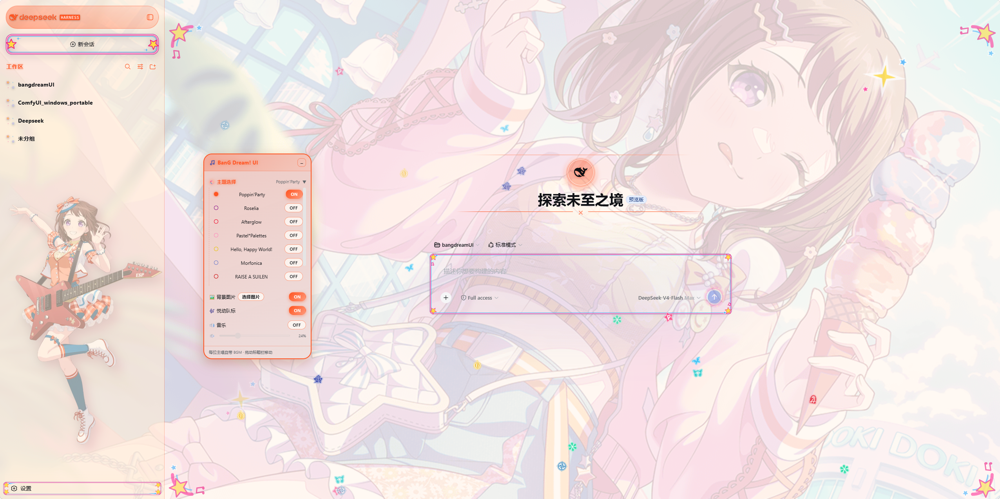
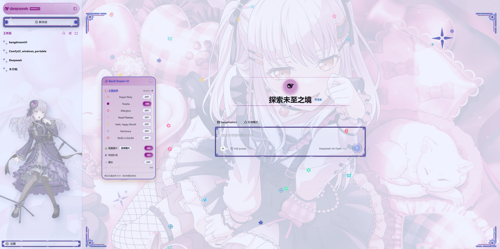
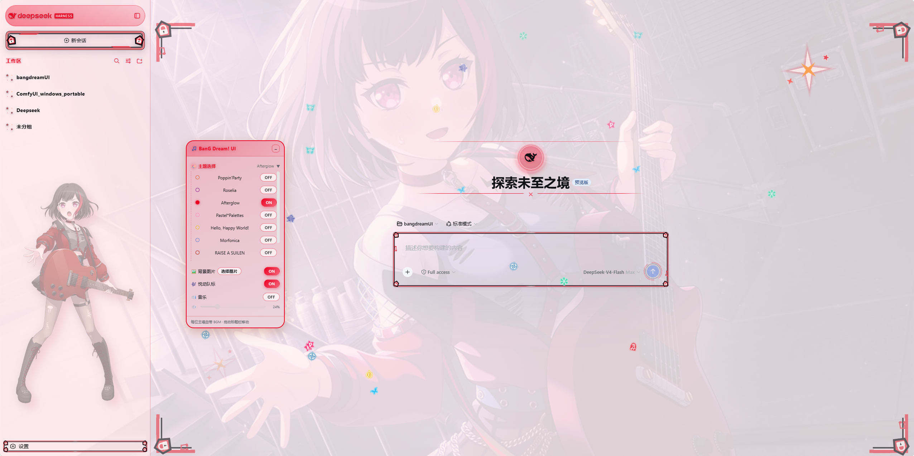

# dsh-bangdream-skin

BanG Dream! 风格 DeepSeek Harness Web UI 皮肤：九支乐队主题、乐队应援色、主题背景、主题 BGM、侧栏装饰与工作区缎带。目前处于未完成状态，后续会缓慢更新。

> 适用于 DeepSeek Harness 的 `web` profile（DSH 0.1.0-rc.x 及相近版本）。

## 截图预览

| 界面截图 1 | 界面截图 2 | 界面截图 3 |
| --- | --- | --- |
|  |  |  |

## 特性

- 🎤 **9 个乐队主题**：Poppin'Party / Roselia / Afterglow / Pastel*Palettes / Hello, Happy World! / Morfonica / RAISE A SUILEN / MyGO!!!!! / Ave Mujica
- 🎨 **主题自动切换**：每个主题对应乐队应援色、默认背景图，UI 装饰暂时只有 Poppin'Party / Roselia / Afterglow
- 🎵 **主题 BGM**：每位主唱内置对应歌曲，支持开关与音量调节
- 🖼️ **自定义背景图**：支持上传图片并持久保存到本地 DSH 存储
- 🧩 **Deep-whale 式细节**：侧栏工作区选中缎带、会话时间轴、运行中宝石呼吸灯、乐队立绘
- 🌗 **亮 / 暗主题适配**
- 🎛️ **可拖拽控制面板**：右下角 🎵 面板，也可在设置页配置

## 安装

### 方式一：本地路径

```sh
dsh plugin --profile web add <本目录绝对路径>
```

### 方式二：从 GitHub 克隆

```sh
git clone https://github.com/AnoTomorin/dsh-bangdream-skin
dsh plugin --profile web add <克隆路径>
```

也可以直接对 DSH 说：“安装这个皮肤包：https://github.com/AnoTomorin/dsh-bangdream-skin”。

安装后**完全重启 `dsh web`**，打开页面右下角出现 🎵 面板即成功。

## 使用

1. 点击右下角 🎵 打开控制面板
2. 在「主题」中选择乐队主题
3. 可切换背景图、BGM、粒子效果等
4. 设置页中也有「🎵 BanG Dream UI」配置入口

## 目录结构

```
dsh-bangdream-skin/
├── bngd-ui/          # DSH 插件包（node 入口 + client bundle + 素材）
├── bngd-ui.ps1       # PowerShell 安装 / 更新 / 打包脚本
├── screenshots/      # DSH Web 界面截图
├── README.md
├── MAINTENANCE.md    # 维护与版本更新流程
├── LICENSE           # 代码许可证（MIT）
└── NOTICE.md         # 第三方素材与再分发限制说明
```

## 素材与版权

- 主题背景、立绘、乐队 Logo、BGM 等素材来自 BanG Dream! 游戏 / 官方素材，仅用于个人学习交流。
- 请勿将本仓库素材用于商业用途。
- 相关版权归 BanG Dream! 版权方（Bushiroad / Craft Egg 等）所有。
- 第三方素材的再分发限制详见 [NOTICE.md](./NOTICE.md)。

## 灵感来源

- 皮肤工程结构（构建预设 `build/tsdown.client.ts`、皮肤脚手架、布局/动画工程）源自 [dsh-deep-whale](https://github.com/Small-tailqwq/dsh-deep-whale) 的 maid-atelier（作者 Small-tailqwq）

## License

- **代码**：本仓库的原创代码以 [MIT License](./LICENSE) 发布。
- **素材**：BanG Dream! 相关素材不属于 MIT License 范围，仅限个人学习交流；再分发限制见 [NOTICE.md](./NOTICE.md)。
